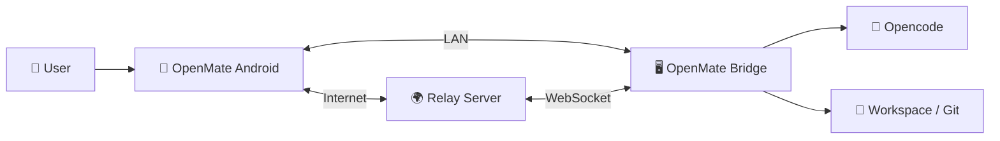
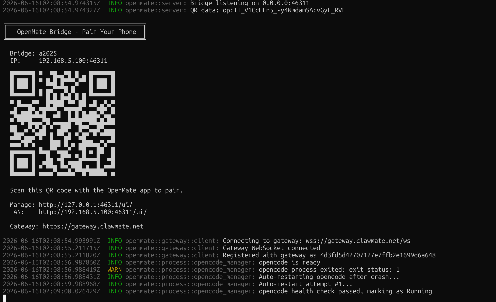
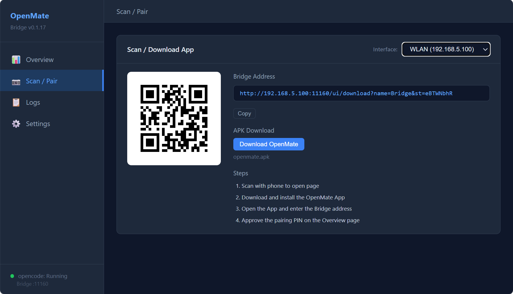
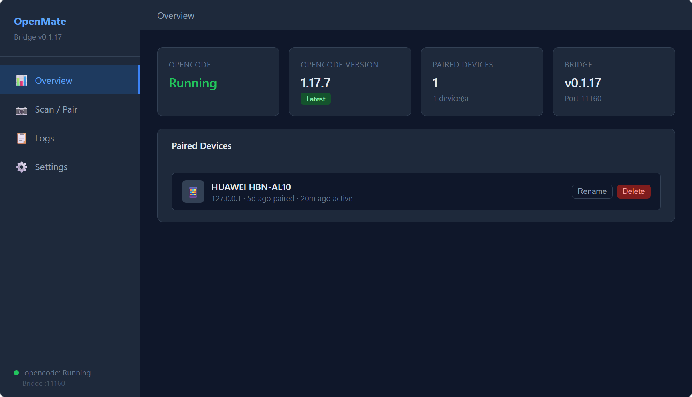
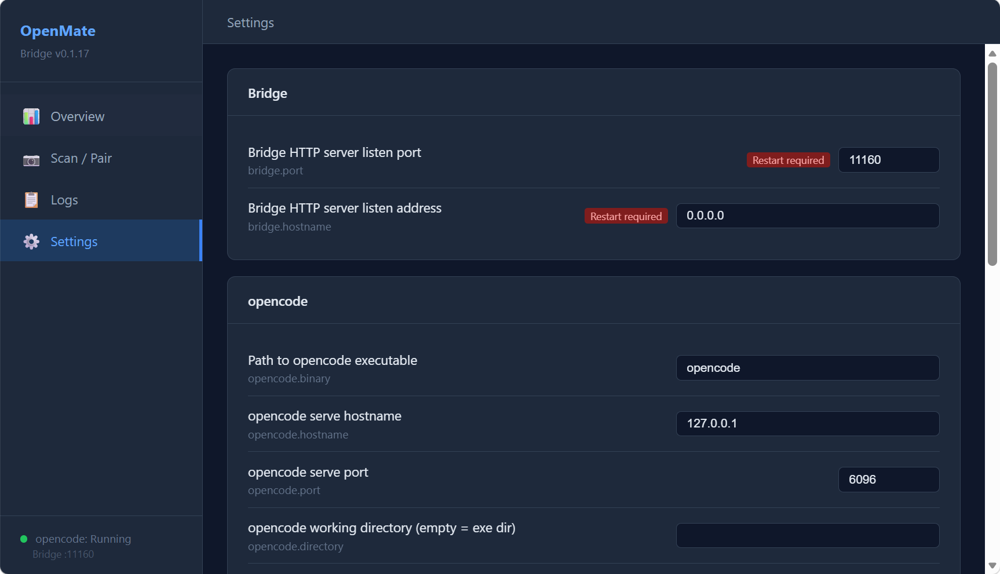
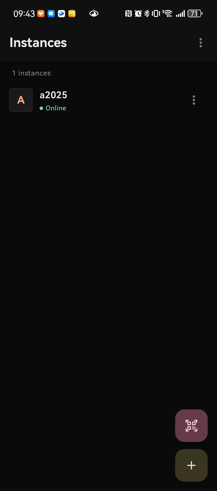
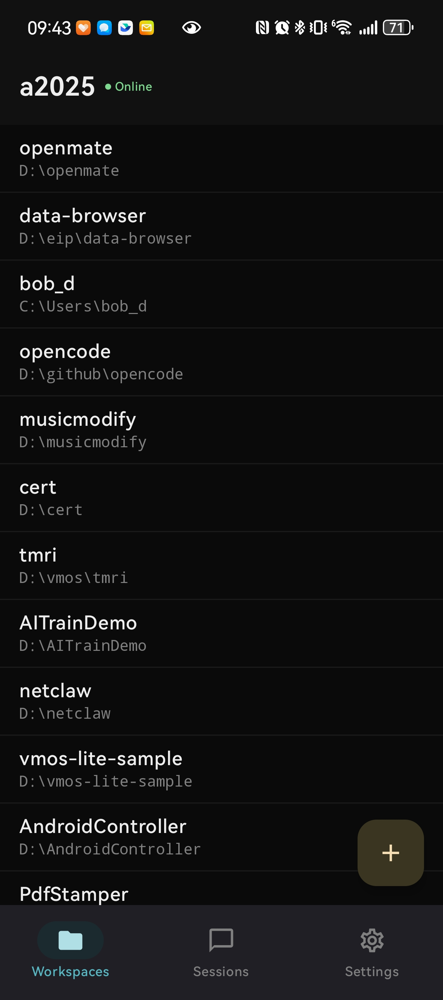
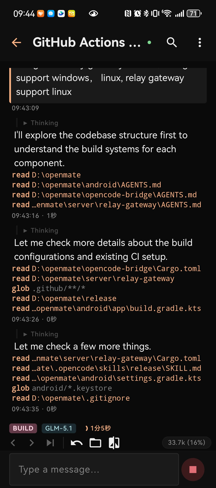
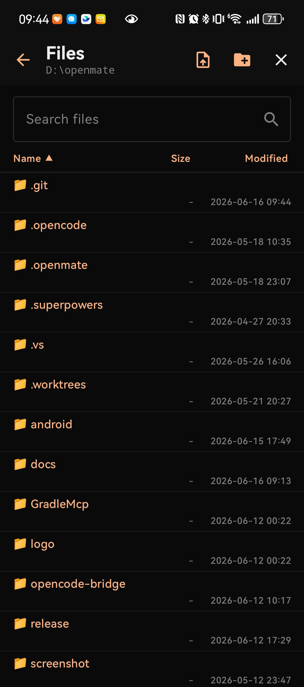
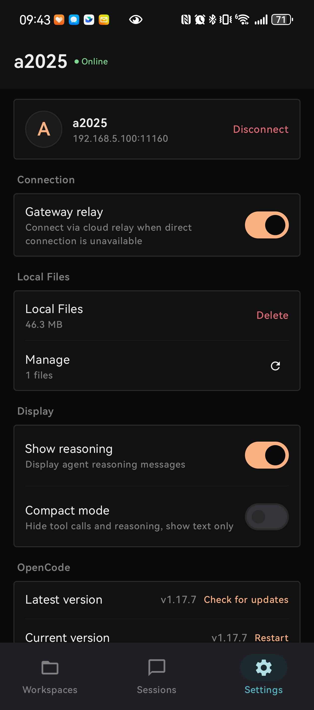

# OpenMate

<p align="center">
  
</p>

OpenMate is a native Android client for [opencode](https://github.com/sst/opencode), letting you monitor and interact with your AI coding sessions from your phone.

Connect to your PC over LAN, or remotely via the cloud relay when you're away. Browse workspaces, read conversations, send messages, respond to permission prompts, and manage tasks — all from your Android device.

## How It Works



OpenMate consists of three components:

- **Bridge Agent** — A lightweight Rust program that runs on your PC alongside opencode. It handles authentication, process management, and proxies requests between your phone and opencode.
- **Android App** — A native Kotlin/Jetpack Compose app that connects to the Bridge directly over LAN, or indirectly via the Relay Server when you're on a different network.
- **Relay Server** — An optional cloud gateway that bridges your phone and PC over the internet using WebSocket tunnels, so you can stay connected even without LAN or Tailscale access.

## Quick Start

### 1. Install the Bridge

Download the latest release for your platform:

- **Windows**: `openmate.exe`
- **Linux**: `openmate-linux-x86_64`

Make sure [opencode](https://github.com/sst/opencode) is installed and available in your PATH.

Run the Bridge:

```bash
# Windows
openmate.exe

# Linux
./openmate
```

Or install it as a system service (auto-starts on boot):

```bash
# Windows
openmate.exe install

# Linux
sudo ./openmate install
```

The Bridge automatically starts `opencode serve` and begins listening for connections.

### 2. Install the Android App

Download `OpenMate-{version}.apk` from [Releases](../../releases) and install it on your phone.

### 3. Pair Your Device

Pairing is done by scanning a QR code:

1. **Get the QR code** — The Bridge displays it in the admin web UI (`http://127.0.0.1:4097/ui/`, auto-opened on Windows). On Linux, the QR code is also printed directly in the terminal — handy for SSH sessions where opening a browser isn't convenient.
2. **Scan** — Open the app and scan the QR code. Pairing and connection are automatic.
3. If you're not on the same LAN, the app automatically connects via the cloud relay.

<details>
<summary>Manual pairing via PIN (alternative)</summary>

If QR scanning isn't available, you can pair with a PIN code:

1. Add an instance in the app with your PC's IP and Bridge port (default: `4097`)
2. The app displays a 6-digit PIN
3. Approve it on your PC:

```bash
openmate approve 123456
```

4. Tap **Confirm** in the app

</details>

## Screenshots

### Bridge — Pairing

<table>
  <tr>
    <td align="center"></td>
    <td align="center"></td>
  </tr>
  <tr>
    <td align="center"><sub>Terminal QR code (also in admin UI)</sub></td>
    <td align="center"><sub>Scan with the Android app to pair</sub></td>
  </tr>
</table>

The Bridge prints a pairing QR code in the terminal (and the admin web UI), so you can pair your phone with a single scan — even over SSH.

### Bridge — Admin UI

<table>
  <tr>
    <td align="center"></td>
    <td align="center"></td>
  </tr>
  <tr>
    <td align="center"><sub>Admin dashboard at <code>http://127.0.0.1:4097/ui/</code></sub></td>
    <td align="center"><sub>Settings (port, opencode path, allowed paths, …)</sub></td>
  </tr>
</table>

### Android App

<table>
  <tr>
    <td align="center"></td>
    <td align="center"></td>
    <td align="center"></td>
    <td align="center"></td>
    <td align="center"></td>
  </tr>
  <tr>
    <td align="center"><sub>Instances</sub></td>
    <td align="center"><sub>Workspaces</sub></td>
    <td align="center"><sub>Session</sub></td>
    <td align="center"><sub>Files</sub></td>
    <td align="center"><sub>Settings</sub></td>
  </tr>
</table>

## Features

- **Workspace & Session Browsing** — View all workspaces, sessions, and conversation history
- **Real-time Chat** — Send messages and receive streaming responses with full Markdown rendering
- **Permission & Question Responses** — Approve/deny tool permissions and answer questions directly from your phone
- **TODO List Tracking** — Monitor task progress (in-progress / pending / completed)
- **Model & Skill Selection** — Switch AI models and select skills
- **File Browser** — Browse workspace directories, view and download files
- **Session Operations** — Abort, compact, or fork sessions
- **Cloud Relay (Optional)** — Connect remotely via a gateway when you're away from your LAN
- **Secure Authentication** — HMAC-SHA256 token-based auth with PIN pairing

## Configuration

The Bridge stores all configuration in a SQLite database (`~/.openmate/bridge.db`) — no config files needed. Settings are managed through the **admin web UI**:

1. Open `http://127.0.0.1:4097/ui/` in your browser (the Bridge opens this automatically on Windows)
2. Adjust settings and save — most take effect immediately; port/hostname changes require a Bridge restart

Key configurable options:

| Setting | Default | Description |
|---------|---------|-------------|
| `bridge.port` | `4097` | Bridge listen port (requires restart) |
| `bridge.hostname` | `0.0.0.0` | Listen address (requires restart) |
| `opencode.binary` | `opencode` | Path to opencode executable |
| `opencode.port` | `4096` | opencode serve port |
| `opencode.auto_start` | `true` | Auto-start opencode on Bridge launch |
| `opencode.auto_restart` | `true` | Auto-restart opencode on crash |
| `fs.allowed_paths` | *(empty = all)* | Filesystem path whitelist |

## Bridge CLI

| Command | Description |
|---------|-------------|
| `openmate` | Run in foreground |
| `openmate install` | Install as system service |
| `openmate uninstall` | Uninstall system service |
| `openmate approve <pin>` | Approve a pairing PIN |
| `openmate reset-token` | Reset secret key (invalidates all tokens) |

## Requirements

- [opencode](https://github.com/sst/opencode) installed on your PC
- Android 8.0+ (API 26+)
- PC and phone on the same network (LAN or Tailscale), or cloud relay enabled

## Download

Get the latest release from the [Releases page](../../releases).

## Documentation

- [Installation Guide](docs/INSTALL.md) — Setup instructions for Bridge and Android app
- [安装指南（中文）](docs/INSTALL.zh-CN.md) — Bridge 和 Android 客户端安装说明
- [Development Guide](docs/DEVELOPMENT.md) — Architecture, build instructions, and API reference
- [开发指南（中文）](docs/DEVELOPMENT.zh-CN.md) — 架构、构建说明和 API 参考
- [Changelog](CHANGELOG.md) — Version history
- [Design Documents](docs/design/) — Technical design docs

## License

This is a personal open-source project. Feel free to use and contribute.
