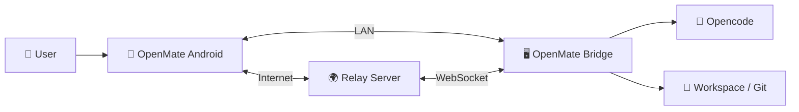

# OpenMate

<p align="center">
  <b>English</b> | <a href="README.zh-CN.md">中文</a>
</p>

<p align="center">
  
</p>

**Control your AI coding agent from anywhere — monitor sessions, approve decisions, and browse code changes, all from your phone.**

## Why OpenMate?

AI coding agents run on your desktop, but you're not always at your desk. OpenMate lets you keep working with your agent from your phone — approve a permission, check on progress, or review a diff without being tied to your computer.

If you already use [opencode](https://github.com/sst/opencode), OpenMate connects to it directly — no extra setup.

## Features

- **Real-time Chat** — Send messages and receive streaming responses with full Markdown rendering
- **Permission & Question Responses** — Approve tool permissions and answer questions instantly from your phone
- **Workspace & Session Browsing** — Browse workspaces, sessions, and full conversation history
- **File Browser** — Browse workspace directories, view files, and download them
- **TODO Tracking** — Monitor task progress (pending, in-progress, completed)
- **Session Operations** — Abort, compact, or fork sessions on the fly
- **Model & Skill Selection** — Switch AI models and select skills
- **Cloud Relay** — The Bridge auto-connects to the cloud relay on launch, so you stay connected even away from your LAN — no extra configuration
- **Simple & Secure Pairing** — Scan a QR code to pair in seconds; HMAC-SHA256 token auth keeps it safe

## System Overview



OpenMate has three components:

- **Bridge Agent** — Lightweight Rust program on your PC alongside opencode. Handles auth, process management, and proxies requests. Connects to the relay automatically on launch.
- **Android App** — Native Kotlin/Jetpack Compose app. Connects to Bridge directly over LAN, or via Relay when you're on a different network.
- **Relay Server** — Cloud gateway that bridges your phone and PC over the internet using WebSocket tunnels, so you stay connected anywhere.

## Get Started in 5 Minutes

> **Prerequisites:** [opencode](https://github.com/sst/opencode) installed on your PC · Android 8.0+ (API 26+) · PC & phone on the same network, or internet access for the cloud relay

### 1. Install Bridge

Download the Bridge for your platform from [Releases](../../releases), then run it:

```bash
# Windows
openmate.exe

# Linux
./openmate
```

The Bridge auto-starts opencode and begins listening — it also auto-connects to the cloud relay, so you can reach it from any network.

### 2. Install Android App

Download `OpenMate-{version}.apk` from [Releases](../../releases) and install on your phone.

### 3. Pair Your Phone

The Bridge shows a **QR code in the terminal** (also in the web UI at `http://127.0.0.1:4097/ui/`):

1. Open the OpenMate app
2. Scan the QR code
3. Done — you're paired and connected

Same network uses LAN for the fastest response; otherwise the app routes through the cloud relay automatically.

**Alternative: Manual PIN pairing** — If QR scanning isn't available, add an instance manually with your PC's IP and port (default: `4097`), then approve the PIN using `openmate approve 123456`.

## Screenshots

### Bridge — Pairing

<table>
  <tr>
    <td align="center"></td>
    <td align="center"></td>
  </tr>
  <tr>
    <td align="center"><sub>QR code in terminal (also in web UI)</sub></td>
    <td align="center"><sub>Scan with the OpenMate app</sub></td>
  </tr>
</table>

### Bridge — Admin Dashboard

<table>
  <tr>
    <td align="center"></td>
    <td align="center"></td>
  </tr>
  <tr>
    <td align="center"><sub>Dashboard at <code>http://127.0.0.1:4097/ui/</code></sub></td>
    <td align="center"><sub>Configure settings (port, paths, etc.)</sub></td>
  </tr>
</table>

### Android App

<table>
  <tr>
    <td align="center"></td>
    <td align="center"></td>
    <td align="center"></td>
    <td align="center"></td>
    <td align="center"></td>
  </tr>
  <tr>
    <td align="center"><sub>Instances</sub></td>
    <td align="center"><sub>Workspaces</sub></td>
    <td align="center"><sub>Session chat</sub></td>
    <td align="center"><sub>File browser</sub></td>
    <td align="center"><sub>Settings</sub></td>
  </tr>
</table>

## Download & Documentation

**Get started:** [Releases page](../../releases)

**Learn more:**
- [Installation Guide](docs/INSTALL.md) — Setup instructions
- [Development Guide](docs/DEVELOPMENT.md) — Architecture and build instructions
- [Changelog](CHANGELOG.md) — Version history
- [Design Documents](docs/design/) — Technical designs

## Configuration & Service

The Bridge is configured through the **admin web UI** at `http://127.0.0.1:4097/ui/` — adjust the listen port, opencode path, filesystem whitelist and more; most changes take effect immediately. (See the [Installation Guide](docs/INSTALL.md) for the full option list.)

**Run as a system service** (auto-start on boot):

```bash
openmate.exe install      # Windows
sudo ./openmate install   # Linux
```

**Useful CLI commands:**

| Command | Description |
|---------|-------------|
| `openmate install` / `uninstall` | Manage the system service |
| `openmate approve <pin>` | Approve a manual pairing PIN |
| `openmate reset-token` | Reset the secret key (invalidates all tokens) |

## License

Licensed under the Apache License, Version 2.0. See [LICENSE](LICENSE) for details.
