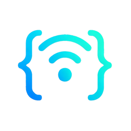

# OpenMate

<p align="center">
  
</p>

OpenMate is a native Android client for [opencode](https://github.com/sst/opencode), letting you monitor and interact with your AI coding sessions from your phone.

Connect to your PC over LAN or Tailscale, browse workspaces, read conversations, send messages, respond to permission prompts, and manage tasks — all from your Android device.

## How It Works

```
┌──────────────┐        LAN / Tailscale        ┌───────────────────┐
│  Android App │  ──── HTTP + SSE ────────────▶│  OpenMate Bridge  │──▶ opencode serve
│  (OpenMate)  │         Bearer Token           │  (Rust)           │   (on your PC)
└──────────────┘                                └───────────────────┘
```

OpenMate consists of two components:

- **Bridge Agent** — A lightweight Rust program that runs on your PC alongside opencode. It handles authentication, process management, and proxies requests between your phone and opencode.
- **Android App** — A native Kotlin/Jetpack Compose app that connects to the Bridge.

## Quick Start

### 1. Install the Bridge

Download the latest release for your platform:

- **Windows**: `openmate.exe`
- **Linux**: `openmate-linux-x86_64`

Make sure [opencode](https://github.com/sst/opencode) is installed and available in your PATH.

Run the Bridge:

```bash
# Windows
openmate.exe

# Linux
./openmate
```

Or install it as a system service (auto-starts on boot):

```bash
# Windows
openmate.exe install

# Linux
sudo ./openmate install
```

The Bridge automatically starts `opencode serve` and begins listening for connections.

### 2. Install the Android App

Download `OpenMate-{version}.apk` from [Releases](../../releases) and install it on your phone.

### 3. Pair Your Device

1. Open the app and add a new instance with your PC's IP address and Bridge port (default: `4097`)
2. The app displays a 6-digit PIN code
3. On your PC, approve the pairing:

```bash
openmate.exe approve 123456
```

4. Tap **Confirm** in the app — done! The pairing token is saved for future connections.

## Features

- **Workspace & Session Browsing** — View all workspaces, sessions, and conversation history
- **Real-time Chat** — Send messages and receive streaming responses with full Markdown rendering
- **Permission & Question Responses** — Approve/deny tool permissions and answer questions directly from your phone
- **TODO List Tracking** — Monitor task progress (in-progress / pending / completed)
- **Model & Skill Selection** — Switch AI models and select skills
- **File Browser** — Browse workspace directories, view and download files
- **Session Operations** — Abort, compact, or fork sessions
- **Cloud Relay (Optional)** — Connect remotely via a gateway when you're away from your LAN
- **Secure Authentication** — HMAC-SHA256 token-based auth with PIN pairing

## Configuration

The Bridge reads optional configuration from `bridge.toml`:

```toml
[bridge]
port = 4097            # Listen port
hostname = "0.0.0.0"   # Listen address
auth_enabled = true    # Enable authentication

[opencode]
binary = "opencode"   # Path to opencode executable
port = 4098            # opencode serve port
auto_start = true      # Auto-start opencode
auto_restart = true    # Auto-restart on crash
```

## Bridge CLI

| Command | Description |
|---------|-------------|
| `openmate` | Run in foreground |
| `openmate install` | Install as system service |
| `openmate uninstall` | Uninstall system service |
| `openmate approve <pin>` | Approve a pairing PIN |
| `openmate reset-token` | Reset secret key (invalidates all tokens) |

## Requirements

- [opencode](https://github.com/sst/opencode) installed on your PC
- Android 8.0+ (API 26+)
- PC and phone on the same network (LAN or Tailscale), or cloud relay enabled

## Download

Get the latest release from the [Releases page](../../releases).

## Documentation

- [Development Guide](docs/DEVELOPMENT.md) — Architecture, build instructions, and API reference
- [Changelog](CHANGELOG.md) — Version history
- [Design Documents](docs/design/) — Technical design docs

## License

This is a personal open-source project. Feel free to use and contribute.
