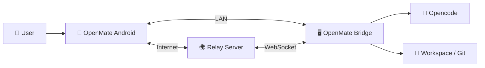

# OpenMate

<p align="center">
  
</p>

**Control your AI coding agent from anywhere — monitor sessions, approve decisions, and browse code changes, all from your phone.**

## Why OpenMate?

AI coding agents run on your desktop where they make decisions and changes. But you're not always at your desk.

OpenMate bridges this gap: you can approve permissions, monitor progress, and review code changes from your phone — whether you're on the same network or on the other side of the world.

If you use [opencode](https://github.com/sst/opencode), OpenMate connects directly to it without extra setup.

## What You Can Do

- **Approve & Control** — Instantly respond to permission requests and questions without being at your desk
- **Monitor Sessions** — Watch real-time conversation history and task progress as your AI agent works
- **Browse & Review** — View workspace directories, read diffs, and download files
- **Full Chat** — Send messages, receive streaming responses with full Markdown rendering
- **Flexible Connectivity** — Connect over LAN for instant response, or use the cloud relay when you're away
- **Simple Pairing** — Scan a QR code to pair your phone in seconds

## System Overview



OpenMate has three components:

- **Bridge Agent** — Lightweight Rust program on your PC alongside opencode. Handles auth, process management, and proxies requests.
- **Android App** — Native Kotlin/Jetpack Compose app. Connects to Bridge directly over LAN, or via Relay when you're on a different network.
- **Relay Server** — Optional cloud gateway. Bridges your phone and PC over the internet using WebSocket, so you stay connected anywhere.

## Get Started in 5 Minutes

### 1. Install Bridge

Download for your platform from [Releases](../../releases):

```bash
# Windows
openmate.exe

# Linux
./openmate
```

The Bridge auto-starts opencode and waits for connections. Make sure [opencode](https://github.com/sst/opencode) is in your PATH.

### 2. Install Android App

Download `OpenMate-{version}.apk` from [Releases](../../releases) and install on your phone.

### 3. Pair Your Phone

The Bridge shows a **QR code in the terminal** (also in the web UI at `http://127.0.0.1:4097/ui/`):

1. Open the OpenMate app
2. Scan the QR code
3. Done! You're paired and connected

If you're not on the same LAN, the app automatically connects via the cloud relay.

**Alternative: Manual PIN pairing** — If QR scanning isn't available, add an instance manually with your PC's IP and port (default: `4097`), then approve the PIN using `openmate approve 123456`.

## Screenshots

### Bridge — Pairing

<table>
  <tr>
    <td align="center"></td>
    <td align="center"></td>
  </tr>
  <tr>
    <td align="center"><sub>QR code in terminal (also in web UI)</sub></td>
    <td align="center"><sub>Scan with the OpenMate app</sub></td>
  </tr>
</table>

### Bridge — Admin Dashboard

<table>
  <tr>
    <td align="center"></td>
    <td align="center"></td>
  </tr>
  <tr>
    <td align="center"><sub>Dashboard at <code>http://127.0.0.1:4097/ui/</code></sub></td>
    <td align="center"><sub>Configure settings (port, paths, etc.)</sub></td>
  </tr>
</table>

### Android App

<table>
  <tr>
    <td align="center"></td>
    <td align="center"></td>
    <td align="center"></td>
    <td align="center"></td>
    <td align="center"></td>
  </tr>
  <tr>
    <td align="center"><sub>Instances</sub></td>
    <td align="center"><sub>Workspaces</sub></td>
    <td align="center"><sub>Session chat</sub></td>
    <td align="center"><sub>File browser</sub></td>
    <td align="center"><sub>Settings</sub></td>
  </tr>
</table>

## Features

- **Workspace & Session Browsing** — View workspaces, sessions, and full conversation history
- **Real-time Chat** — Send messages and receive streaming responses with Markdown rendering
- **Permission Responses** — Approve/deny tool permissions and answer questions instantly
- **TODO Tracking** — Monitor task progress (pending, in-progress, completed)
- **Model & Skill Selection** — Switch AI models and select skills on the fly
- **File Browser** — Browse workspace directories, view files, and download them
- **Session Operations** — Abort, compact, or fork sessions from your phone
- **Cloud Relay** — Connect remotely via gateway when away from LAN
- **Secure Auth** — HMAC-SHA256 token-based auth with simple PIN pairing

## Requirements

- [opencode](https://github.com/sst/opencode) installed on your PC
- Android 8.0+ (API 26+)
- PC and phone on same network (LAN or Tailscale), or cloud relay enabled

## Download & Documentation

**Get started:** [Releases page](../../releases)

**Learn more:**
- [Installation Guide](docs/INSTALL.md) — Setup instructions
- [安装指南（中文）](docs/INSTALL.zh-CN.md) — 安装说明
- [Development Guide](docs/DEVELOPMENT.md) — Architecture and build instructions
- [开发指南（中文）](docs/DEVELOPMENT.zh-CN.md) — 架构与构建说明
- [Changelog](CHANGELOG.md) — Version history
- [Design Documents](docs/design/) — Technical designs

---

## Advanced Configuration & Technical Details

### Configuration

The Bridge stores all configuration in a SQLite database (`~/.openmate/bridge.db`). Manage settings via the **admin web UI**:

1. Open `http://127.0.0.1:4097/ui/`
2. Adjust settings — most take effect immediately; port/hostname changes require restart

**Key Options:**

| Setting | Default | Description |
|---------|---------|-------------|
| `bridge.port` | `4097` | Bridge listen port (restart required) |
| `bridge.hostname` | `0.0.0.0` | Listen address (restart required) |
| `opencode.binary` | `opencode` | Path to opencode executable |
| `opencode.port` | `4096` | opencode serve port |
| `opencode.auto_start` | `true` | Auto-start opencode on Bridge launch |
| `opencode.auto_restart` | `true` | Auto-restart opencode on crash |
| `fs.allowed_paths` | *(empty = all)* | Filesystem whitelist |

### Installing Bridge as System Service

For auto-startup on boot:

```bash
# Windows
openmate.exe install

# Linux
sudo ./openmate install

# Uninstall
openmate.exe uninstall  # Windows
sudo ./openmate uninstall  # Linux
```

### Bridge CLI Commands

| Command | Description |
|---------|-------------|
| `openmate` | Run in foreground |
| `openmate install` | Install as system service |
| `openmate uninstall` | Uninstall system service |
| `openmate approve <pin>` | Approve a pairing PIN |
| `openmate reset-token` | Reset secret key (invalidates all tokens) |

## License

Licensed under the Apache License, Version 2.0. See [LICENSE](LICENSE) for details.
