# OpenMate

<p align="center">
  <b>English</b> | <a href="README.zh-CN.md">中文</a>
</p>

<p align="center">
  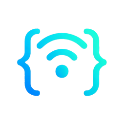
</p>

**The mobile client for [opencode](https://github.com/sst/opencode).** Chat with your coding agent, approve its decisions, and browse your workspaces from your phone — with incremental sync and a local copy of your sessions, so you can **read everything offline**.

> **opencode v2 only.** OpenMate targets the opencode v2 architecture (it removed the v1 `message`/`part` APIs); earlier versions are not supported.

> **Not affiliated with OpenCode.** OpenMate is an independent community project; it is not built by, endorsed by, or affiliated with the OpenCode team.

## Sync & Offline

OpenMate is built to be usable anywhere, not only while you're connected.

- **Incremental sync** — the Bridge reads opencode's own database and serves only what changed (`seq`-based). New messages, in-place edits, and the deletions caused by a revert are applied exactly.
- **Not tied to SSE** — real-time events refresh the UI instantly, but correctness comes from sync, not from the connection. A dropped stream never loses data.
- **Offline viewing** — every session you've opened is cached on-device. Scroll through history, check TODOs, and review diffs with no network at all.
- **Self-healing** — after a reconnect, polling plus incremental catch-up bring the local copy back in sync automatically.

## Features

- **Chat** — send prompts and read responses, with full Markdown rendering
- **Permissions & questions** — approve tool permissions and answer questions from your phone
- **Workspaces & sessions** — browse workspaces, sessions, and complete conversation history
- **File browser** — browse, view, and download workspace files
- **Diff viewer** — review code changes
- **Revert** — roll back to an earlier message, with unrevert
- **TODO tracking** — follow task progress (pending / in-progress / done)
- **Session operations** — abort, compact, or fork sessions
- **Model & skill selection** — switch models and pick skills
- **Cloud relay** — the Bridge connects to the cloud relay on launch, so you stay reachable off your LAN with no extra configuration
- **Simple & secure pairing** — scan a QR code to pair in seconds; HMAC-SHA256 token auth keeps it safe

## Architecture

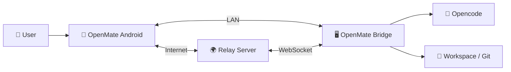
```mermaid
flowchart LR

    User["📱 User"]
    Mobile["📱 OpenMate Android"]
    Relay["🌍 Relay Server"]
    Bridge["🖥️ OpenMate Bridge"]
    Opencode["🤖 Opencode"]
    Workspace["📂 Workspace / Git"]

    User --> Mobile

    Mobile <-->|LAN| Bridge
    Mobile <-->|Internet| Relay
    Relay <-->|WebSocket| Bridge

    Bridge --> Opencode
    Bridge --> Workspace
```

OpenMate has three components:

- **Bridge Agent** — Lightweight Rust program on your PC alongside opencode. Reads opencode's database to serve incremental sync, handles auth and process management, and proxies requests. Connects to the relay automatically on launch.
- **Android App** — Native Kotlin/Jetpack Compose app with a local database. Keeps sessions in sync and lets you read them offline. Connects to Bridge directly over LAN, or via Relay when you're on a different network.
- **Relay Server** — Cloud gateway that bridges your phone and PC over the internet using WebSocket tunnels, so you stay connected anywhere.

## Supported Platforms

| Platform | Status |
|----------|--------|
| Windows | ✅ Supported |
| Linux (x86_64, arm64) | ✅ Supported |
| macOS (Apple Silicon) | ⚠️ Should work, but not yet tested |

Linux binaries are statically linked (musl) and run on any distribution regardless of glibc version. Prebuilt binaries for all platforms are on the [Releases](../../releases) page. The Android app requires Android 8.0+ (API 26+).

## Get Started in 5 Minutes

> **Prerequisites:** [opencode](https://github.com/sst/opencode) **v2** installed on your PC · Android 8.0+ (API 26+) · PC & phone on the same network, or internet access for the cloud relay

### 1. Install Bridge

Download the Bridge for your platform from [Releases](../../releases), then run it:

```bash
# Windows
openmate.exe

# Linux
./openmate
```

The Bridge auto-starts opencode and begins listening — it also auto-connects to the cloud relay, so you can reach it from any network.

### 2. Install Android App

**Direct APK:** download `OpenMate-{version}.apk` from [Releases](../../releases) and install on your phone.

**China mirror:** if GitHub is slow or unreachable, download the same APK from the [AtomGit mirror](https://atomgit.com/article88/openmate).

**Auto-updates (Obtainium):** install [Obtainium](https://github.com/ImranR98/Obtainium) and add `https://github.com/bob-dawson/openmate` as a source. Obtainium watches GitHub Releases, so every new version shows up as a one-tap update.

### 3. Pair Your Phone

The Bridge shows a **QR code in the terminal** (also in the web UI at `http://127.0.0.1:4097/ui/`):

1. Open the OpenMate app
2. Scan the QR code
3. Done — you're paired and connected

Same network uses LAN for the fastest response; otherwise the app routes through the cloud relay automatically.

**Alternative: Manual PIN pairing** — If QR scanning isn't available, add an instance manually with your PC's IP and port (default: `4097`), then approve the PIN using `openmate approve 123456`.

## Screenshots

### Bridge — Pairing

<table>
  <tr>
    <td align="center">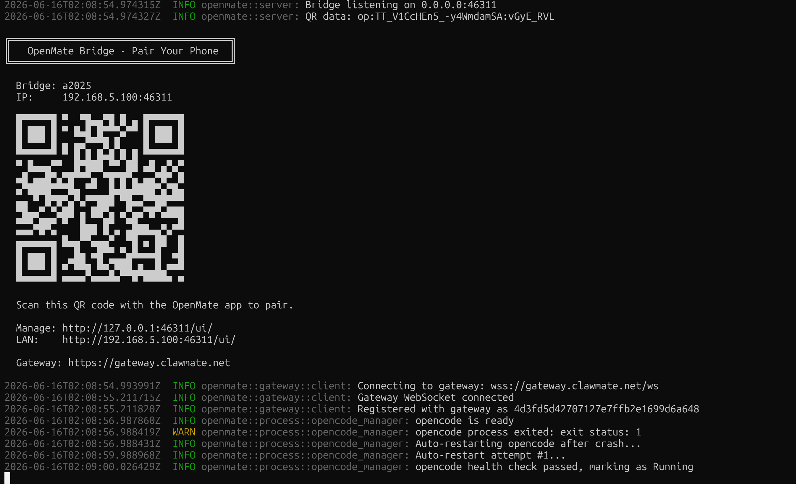</td>
    <td align="center">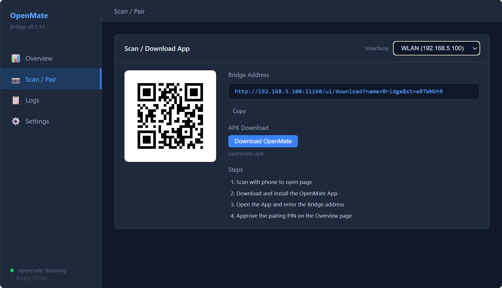</td>
  </tr>
  <tr>
    <td align="center"><sub>QR code in terminal (also in web UI)</sub></td>
    <td align="center"><sub>Scan with the OpenMate app</sub></td>
  </tr>
</table>

### Bridge — Admin Dashboard

<table>
  <tr>
    <td align="center">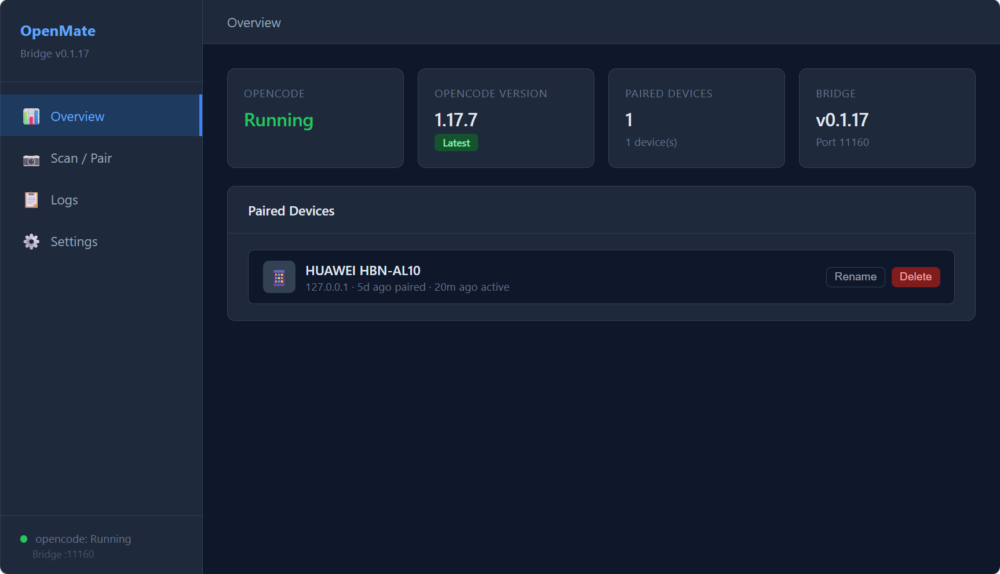</td>
    <td align="center">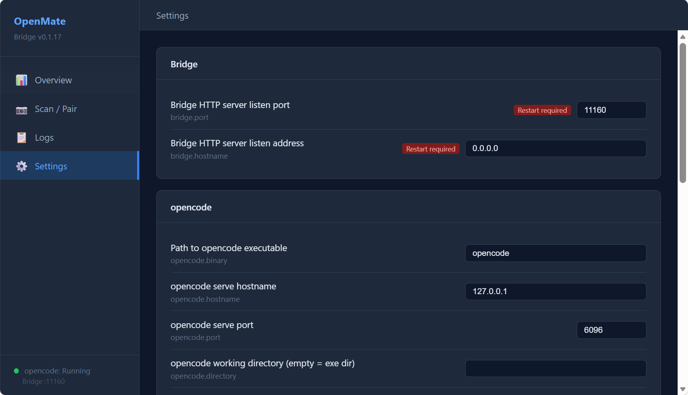</td>
  </tr>
  <tr>
    <td align="center"><sub>Dashboard at <code>http://127.0.0.1:4097/ui/</code></sub></td>
    <td align="center"><sub>Configure settings (port, paths, etc.)</sub></td>
  </tr>
</table>

### Android App

<table>
  <tr>
    <td align="center">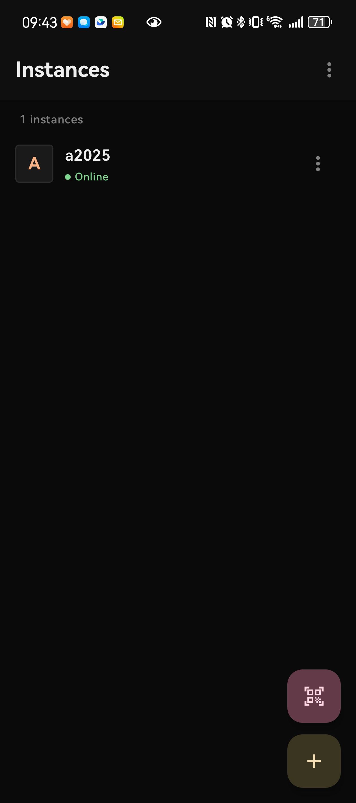</td>
    <td align="center">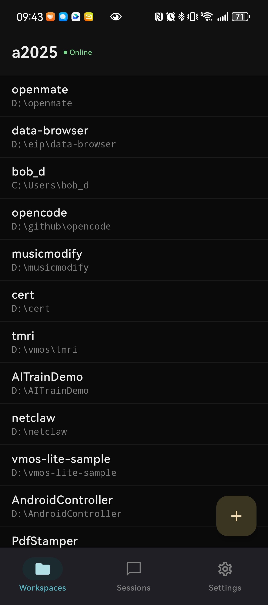</td>
    <td align="center">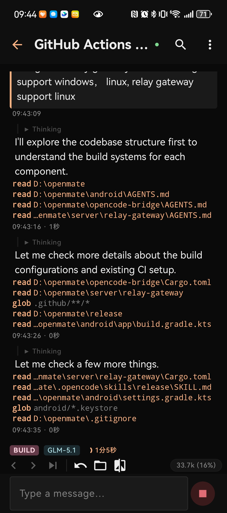</td>
    <td align="center">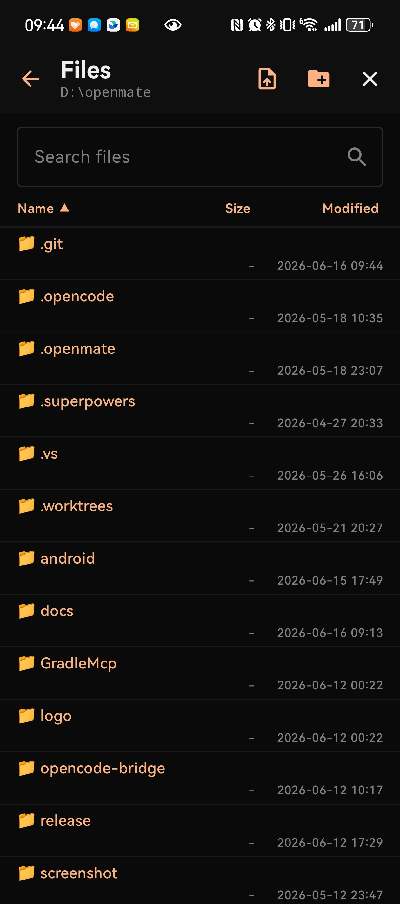</td>
    <td align="center">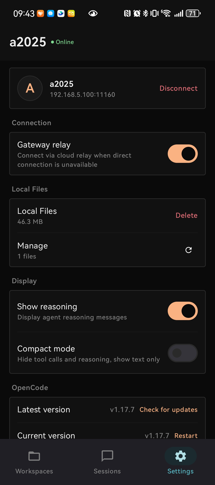</td>
  </tr>
  <tr>
    <td align="center"><sub>Instances</sub></td>
    <td align="center"><sub>Workspaces</sub></td>
    <td align="center"><sub>Session chat</sub></td>
    <td align="center"><sub>File browser</sub></td>
    <td align="center"><sub>Settings</sub></td>
  </tr>
</table>

## Download & Documentation

**Get started:** [Releases page](../../releases)

**China mirror (AtomGit):** [atomgit.com/article88/openmate](https://atomgit.com/article88/openmate) — branches, tags and release artifacts (APK + all platform binaries) are mirrored automatically, for when GitHub is slow or unreachable.

**Learn more:**
- [Installation Guide](docs/INSTALL.md) — Setup instructions
- [Development Guide](docs/DEVELOPMENT.md) — Architecture and build instructions
- [Changelog](CHANGELOG.md) — Version history
- [Design Documents](docs/design/) — Technical designs

## Configuration & Service

The Bridge is configured through the **admin web UI** at `http://127.0.0.1:4097/ui/` — adjust the listen port, opencode path, filesystem whitelist and more; most changes take effect immediately. (See the [Installation Guide](docs/INSTALL.md) for the full option list.)

**Run as a system service** (auto-start on boot):

```bash
openmate.exe install      # Windows
sudo ./openmate install   # Linux
```

**Useful CLI commands:**

| Command | Description |
|---------|-------------|
| `openmate install` / `uninstall` | Manage the system service |
| `openmate approve <pin>` | Approve a manual pairing PIN |
| `openmate reset-token` | Reset the secret key (invalidates all tokens) |

## License

Licensed under the Apache License, Version 2.0. See [LICENSE](LICENSE) for details.
