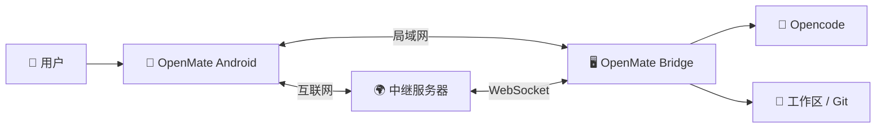

# OpenMate

<p align="center">
  <a href="README.md">English</a> | <b>中文</b>
</p>

<p align="center">
  
</p>

**随时随地掌控你的 AI 编码助手——在手机上监控会话、批准决策、浏览代码变更。**

## 为什么需要 OpenMate？

AI 编码助手运行在你的桌面电脑上，但你不可能时刻守在电脑前。OpenMate 让你用手机继续与助手协作——批准权限、查看进度、审阅 diff，不再被电脑束缚。

如果你已经在用 [opencode](https://github.com/sst/opencode)，OpenMate 可以直接接入，无需额外配置。

## 功能特性

- **实时聊天** — 发送消息，接收流式响应，完整渲染 Markdown
- **权限与问答响应** — 在手机上即时批准工具权限、回答助手提出的问题
- **工作区与会话浏览** — 浏览工作区、会话和完整的对话历史
- **文件浏览器** — 浏览工作区目录、查看文件并下载
- **TODO 跟踪** — 监控任务进度（待办 / 进行中 / 已完成）
- **会话操作** — 随时中止、压缩或分叉会话
- **模型与技能切换** — 切换 AI 模型、选择技能
- **云端中继** — Bridge 启动即自动连接云中继，即使不在同一局域网也能保持连接，无需额外配置
- **简单安全的配对** — 扫码即可在几秒内配对；采用 HMAC-SHA256 令牌认证保障安全

## 系统概览



OpenMate 由三个组件构成：

- **Bridge 代理** — 运行在你 PC 上的轻量级 Rust 程序，与 opencode 并存。负责鉴权、进程管理，并在手机与 opencode 之间转发请求。启动时自动连接中继服务器。
- **Android 客户端** — 原生 Kotlin / Jetpack Compose 应用。通过局域网直连 Bridge，或在不同网络时经由中继服务器连接。
- **中继服务器** — 云端网关，通过 WebSocket 隧道在手机与 PC 之间建立互联，让你在任何地方都能保持连接。

## 5 分钟快速上手

> **前置条件：** PC 上已安装 [opencode](https://github.com/sst/opencode) · Android 8.0+（API 26+）· 手机与 PC 处于同一网络，或可通过互联网访问云中继

### 1. 安装 Bridge

从 [Releases](../../releases) 下载对应平台的 Bridge，然后运行：

```bash
# Windows
openmate.exe

# Linux
./openmate
```

Bridge 会自动启动 opencode 并开始监听——同时会自动连接云中继，因此你在任何网络下都能访问到它。

### 2. 安装 Android 客户端

从 [Releases](../../releases) 下载 `OpenMate-{version}.apk` 并安装到手机。

### 3. 配对手机

Bridge 会在**终端显示一个二维码**（同时也可在 Web 管理页面 `http://127.0.0.1:4097/ui/` 查看）：

1. 打开 OpenMate 客户端
2. 扫描二维码
3. 完成——配对并连接成功

同一网络下走局域网，响应最快；否则客户端会自动经由云中继连接。

**备选：手动 PIN 配对** — 如果无法扫码，可在客户端手动添加实例（填入 PC 的 IP 和端口，默认 `4097`），然后在 PC 上执行 `openmate approve 123456` 批准该 PIN。

## 截图预览

### Bridge —— 配对

<table>
  <tr>
    <td align="center"></td>
    <td align="center"></td>
  </tr>
  <tr>
    <td align="center"><sub>终端中的二维码（Web 管理页面同样可查看）</sub></td>
    <td align="center"><sub>用 OpenMate 客户端扫码</sub></td>
  </tr>
</table>

### Bridge —— 管理面板

<table>
  <tr>
    <td align="center"></td>
    <td align="center"></td>
  </tr>
  <tr>
    <td align="center"><sub>管理面板：<code>http://127.0.0.1:4097/ui/</code></sub></td>
    <td align="center"><sub>配置项（端口、路径等）</sub></td>
  </tr>
</table>

### Android 客户端

<table>
  <tr>
    <td align="center"></td>
    <td align="center"></td>
    <td align="center"></td>
    <td align="center"></td>
    <td align="center"></td>
  </tr>
  <tr>
    <td align="center"><sub>实例列表</sub></td>
    <td align="center"><sub>工作区</sub></td>
    <td align="center"><sub>会话聊天</sub></td>
    <td align="center"><sub>文件浏览器</sub></td>
    <td align="center"><sub>设置</sub></td>
  </tr>
</table>

## 下载与文档

**获取程序：** [Releases 发布页](../../releases)

**了解更多：**
- [安装指南（中文）](docs/INSTALL.zh-CN.md) — 安装说明
- [开发指南（中文）](docs/DEVELOPMENT.zh-CN.md) — 架构与构建说明
- [更新日志](CHANGELOG.md) — 版本历史
- [设计文档](docs/design/) — 技术设计

## 配置与服务

Bridge 通过 **Web 管理页面** `http://127.0.0.1:4097/ui/` 进行配置——可调整监听端口、opencode 路径、文件系统白名单等，大部分改动即时生效。（完整配置项列表见[安装指南](docs/INSTALL.zh-CN.md)。）

**作为系统服务运行**（开机自启）：

```bash
openmate.exe install      # Windows
sudo ./openmate install   # Linux
```

**常用 CLI 命令：**

| 命令 | 说明 |
|---------|-------------|
| `openmate install` / `uninstall` | 安装 / 卸载系统服务 |
| `openmate approve <pin>` | 批准手动配对的 PIN |
| `openmate reset-token` | 重置密钥（会使所有令牌失效） |

## 许可证

基于 Apache License 2.0 开源，详见 [LICENSE](LICENSE)。
