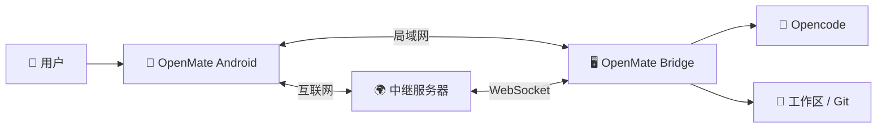

# OpenMate

<p align="center">
  <a href="README.md">English</a> | <b>中文</b>
</p>

<p align="center">
  
</p>

**OpenCode 的移动客户端。** 用手机与你的编码助手对话、批准它的操作、浏览工作区——通过增量同步在本地保存一份会话副本，**离线也能随时查看**。

> **仅支持 opencode v2。** OpenMate 面向 opencode v2 架构（v1 的 `message`/`part` API 已被移除），不支持更早版本。

> **非官方项目。** OpenMate 是独立的社区项目，与 OpenCode 官方团队无关，亦未获其背书。

## 同步与离线

OpenMate 的目标是"随时随地都能看"，而不只是连上网络时才能用。

- **增量同步**：Bridge 直接读取 opencode 自己的数据库，只返回变化的部分（基于 `seq`）。新增消息、就地更新，以及回滚（revert）造成的删除，都能精确应用。
- **不依赖 SSE**：实时事件让界面即时刷新，但正确性来自同步而非连接本身；SSE 断连不会丢数据。
- **离线可查看**：打开过的会话都会缓存在本地。没有网络也能翻阅历史、查看 TODO、审阅 diff。
- **自动补同步**：重新连上后，轮询 + 增量追赶会自动把本地副本拉回一致。

## 功能特性

- **聊天** — 发送消息、查看回复，完整渲染 Markdown
- **权限与问答** — 在手机上批准工具权限、回答助手提问
- **工作区与会话** — 浏览工作区、会话与完整对话历史
- **文件浏览器** — 浏览、查看并下载工作区文件
- **Diff 查看** — 审阅代码变更
- **消息回滚** — 回退到之前的消息，并支持恢复（unrevert）
- **TODO 跟踪** — 跟进任务进度（待办 / 进行中 / 已完成）
- **会话操作** — 中止、压缩、分叉会话
- **模型与技能切换** — 切换 AI 模型、选择技能
- **云端中继** — Bridge 启动即自动连接云中继，不在同一局域网也能访问，无需额外配置
- **简单安全的配对** — 扫码几秒完成配对；HMAC-SHA256 令牌认证保障安全

## 架构


```mermaid
flowchart LR

    User["📱 用户"]
    Mobile["📱 OpenMate Android"]
    Relay["🌍 中继服务器"]
    Bridge["🖥️ OpenMate Bridge"]
    Opencode["🤖 Opencode"]
    Workspace["📂 工作区 / Git"]

    User --> Mobile

    Mobile <-->|局域网| Bridge
    Mobile <-->|互联网| Relay
    Relay <-->|WebSocket| Bridge

    Bridge --> Opencode
    Bridge --> Workspace
```

OpenMate 由三个组件构成：

- **Bridge 代理** — 运行在你 PC 上的轻量级 Rust 程序，与 opencode 并存。读取 opencode 数据库以提供增量同步，负责鉴权与进程管理，并转发请求。启动时自动连接中继服务器。
- **Android 客户端** — 原生 Kotlin / Jetpack Compose 应用，带本地数据库。保持会话同步，支持离线查看。通过局域网直连 Bridge，或在不同网络时经由中继服务器连接。
- **中继服务器** — 云端网关，通过 WebSocket 隧道在手机与 PC 之间建立互联，让你在任何地方都能保持连接。

## 支持的平台

| 平台 | 状态 |
|----------|--------|
| Windows | ✅ 支持 |
| Linux (x86_64, arm64) | ✅ 支持 |
| macOS (Apple Silicon) | ⚠️ 应该可用，但尚未测试 |

Linux 二进制为静态链接（musl），可在任意发行版上运行，无 glibc 版本要求。各平台预编译二进制均可在 [Releases](../../releases) 页面下载。Android 客户端需 Android 8.0+（API 26+）。

## 5 分钟快速上手

> **前置条件：** PC 上已安装 [opencode](https://github.com/sst/opencode) **v2** · Android 8.0+（API 26+）· 手机与 PC 处于同一网络，或可通过互联网访问云中继

### 1. 安装 Bridge

从 [Releases](../../releases) 下载对应平台的 Bridge，然后运行：

```bash
# Windows
openmate.exe

# Linux
./openmate
```

Bridge 会自动启动 opencode 并开始监听——同时会自动连接云中继，因此你在任何网络下都能访问到它。

### 2. 安装 Android 客户端

**直接安装 APK：** 从 [Releases](../../releases) 下载 `OpenMate-{version}.apk` 并安装到手机；GitHub 访问受限时，可从 [AtomGit 国内镜像](https://atomgit.com/article88/openmate) 下载同一 APK。

**自动更新（Obtainium）：** 安装 [Obtainium](https://github.com/ImranR98/Obtainium)，添加源 `https://github.com/bob-dawson/openmate`。Obtainium 会跟踪 GitHub Releases，每次新版本都会提示一键更新。

### 3. 配对手机

Bridge 会在**终端显示一个二维码**（同时也可在 Web 管理页面 `http://127.0.0.1:4097/ui/` 查看）：

1. 打开 OpenMate 客户端
2. 扫描二维码
3. 完成——配对并连接成功

同一网络下走局域网，响应最快；否则客户端会自动经由云中继连接。

**备选：手动 PIN 配对** — 如果无法扫码，可在客户端手动添加实例（填入 PC 的 IP 和端口，默认 `4097`），然后在 PC 上执行 `openmate approve 123456` 批准该 PIN。

## 截图预览

### Bridge —— 配对

<table>
  <tr>
    <td align="center"></td>
    <td align="center"></td>
  </tr>
  <tr>
    <td align="center"><sub>终端中的二维码（Web 管理页面同样可查看）</sub></td>
    <td align="center"><sub>用 OpenMate 客户端扫码</sub></td>
  </tr>
</table>

### Bridge —— 管理面板

<table>
  <tr>
    <td align="center"></td>
    <td align="center"></td>
  </tr>
  <tr>
    <td align="center"><sub>管理面板：<code>http://127.0.0.1:4097/ui/</code></sub></td>
    <td align="center"><sub>配置项（端口、路径等）</sub></td>
  </tr>
</table>

### Android 客户端

<table>
  <tr>
    <td align="center"></td>
    <td align="center"></td>
    <td align="center"></td>
    <td align="center"></td>
    <td align="center"></td>
  </tr>
  <tr>
    <td align="center"><sub>实例列表</sub></td>
    <td align="center"><sub>工作区</sub></td>
    <td align="center"><sub>会话聊天</sub></td>
    <td align="center"><sub>文件浏览器</sub></td>
    <td align="center"><sub>设置</sub></td>
  </tr>
</table>

## 下载与文档

**获取程序：** [Releases 发布页](../../releases)

**国内镜像（AtomGit）：** [atomgit.com/article88/openmate](https://atomgit.com/article88/openmate) — 分支、标签与 Release 产物（APK 及各平台二进制）自动同步，GitHub 访问受限时可用。

**了解更多：**
- [安装指南（中文）](docs/INSTALL.zh-CN.md) — 安装说明
- [开发指南（中文）](docs/DEVELOPMENT.zh-CN.md) — 架构与构建说明
- [更新日志](CHANGELOG.md) — 版本历史
- [设计文档](docs/design/) — 技术设计

## 配置与服务

Bridge 通过 **Web 管理页面** `http://127.0.0.1:4097/ui/` 进行配置——可调整监听端口、opencode 路径、文件系统白名单等，大部分改动即时生效。（完整配置项列表见[安装指南](docs/INSTALL.zh-CN.md)。）

**作为系统服务运行**（开机自启）：

```bash
openmate.exe install      # Windows
sudo ./openmate install   # Linux
```

**常用 CLI 命令：**

| 命令 | 说明 |
|---------|-------------|
| `openmate install` / `uninstall` | 安装 / 卸载系统服务 |
| `openmate approve <pin>` | 批准手动配对的 PIN |
| `openmate reset-token` | 重置密钥（会使所有令牌失效） |

## 许可证

基于 Apache License 2.0 开源，详见 [LICENSE](LICENSE)。
